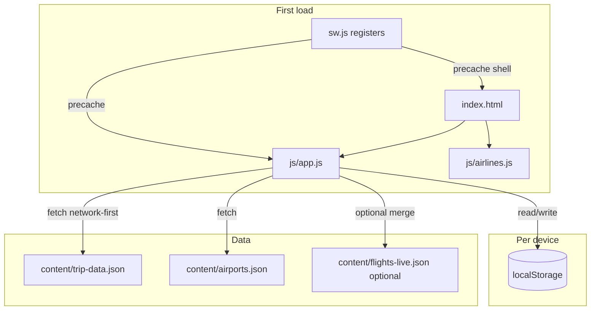

# Triple — Tasmania & Melbourne trip planner

**Triple** is a **static, installable web app** (PWA) for a December 2026 group trip to Tasmania and Melbourne. It bundles day-by-day itineraries, Leaflet maps, a budget with charts, a booking checklist, accommodation, tips, and a **flight board** with optional live data merge.

**How it is built:** trip copy and structure live in JSON files loaded at runtime. Personalization—edits, checklist state, custom flights, auth session—is stored in **`localStorage`** on each device only. **There is no backend** in this repository; everything runs in the browser.

| | |
|---|---|
| **Production branch** | `main` |
| **Shipped app version** | `1.0.39` (`content/trip-data.json` → `appVersion`) |
| **Service worker cache id** | `triple-v49` (`sw.js` → `CACHE`) |
| **Human-readable changelog** | [`VERSION.md`](VERSION.md) (newest → oldest; regenerate with `node scripts/generate-version-md.mjs`) |
| **Example GitHub Pages URL** | `https://thisguyse19.github.io/cursor/` |

> Replace the hostname/path if your GitHub user, org, or Pages base path differs. Confirm under **Repository → Settings → Pages**.

---

## Table of contents

1. [For new contributors (start here)](#for-new-contributors-start-here)
2. [Prerequisites](#prerequisites)
3. [Mental model \& architecture](#mental-model--architecture)
4. [Boot sequence (what runs when you open the app)](#boot-sequence-what-runs-when-you-open-the-app)
5. [Glossary](#glossary)
6. [Highlights](#highlights)
7. [Tech stack](#tech-stack)
8. [Repository layout](#repository-layout)
9. [Local development](#local-development)
10. [Browser DevTools (debugging cheat sheet)](#browser-devtools-debugging-cheat-sheet)
11. [Common tasks (recipes)](#common-tasks-recipes)
12. [Content \& data files](#content--data-files)
13. [Personalization \& storage](#personalization--storage)
14. [Backup \& restore](#backup--restore)
15. [Progressive Web App](#progressive-web-app)
16. [UI layout \& tools](#ui-layout--tools)
17. [Security \& privacy](#security--privacy)
18. [Release checklist](#release-checklist)
19. [JavaScript structure \& globals](#javascript-structure--globals)
20. [Styles \& theming](#styles--theming)
21. [Troubleshooting](#troubleshooting)
22. [Contributing / forking](#contributing--forking)
23. [License / usage](#license--usage)

---

## For new contributors (start here)

If you are early in your web career, this section explains **how to approach the codebase** without getting lost.

1. **Run the app locally** (see [Local development](#local-development)). Triple is “just” HTML + CSS + JS; there is no `npm install` for the app itself. If you can open `http://localhost:8080` and see the trip planner, you are in good shape.
2. **Skim the skeleton:** open `index.html` and notice: auth overlay, mobile header, sidebar, one shared **tools dropdown** (cog menu), and many **modals**. The main page content is a set of `<section>` blocks toggled by `showPage`.
3. **Follow one user action:** in DevTools, search in `js/app.js` for `function showPage` and set a breakpoint inside it. Click a sidebar link and watch: navigation class toggles, scroll position, maybe map resize.
4. **Understand where data lives:** static trip text comes from `content/trip-data.json`. Per-user tweaks live in `localStorage` under keys documented in [Personalization \& storage](#personalization--storage).
5. **Read the changelog as product history:** open [`VERSION.md`](VERSION.md) to see **why** features exist (many entries document iOS PWA quirks, map engine changes, etc.).

When you change behavior, update **`content/trip-data.json`** (`appVersion` + `versions`) and **`sw.js`** (`CACHE`) per the [Release checklist](#release-checklist), then refresh [`VERSION.md`](VERSION.md) with `node scripts/generate-version-md.mjs`.

---

## Prerequisites

You should be comfortable with:

- **HTML:** sections, buttons, forms, basic `id` / `class` usage.
- **CSS:** variables (`:root`), flexbox, `position: fixed`, and media queries.
- **JavaScript:** functions, `async`/`await`, `fetch`, `JSON.parse`, `try`/`catch`, and the idea that **`window.myFn`** makes a function callable from HTML `onclick="myFn()"`.
- **Browser DevTools:** Elements, Console, Network, Application (Storage + Service Workers).

Helpful but optional: PWAs (manifest + service workers), Leaflet, Chart.js.

---

## Mental model & architecture



- **Single-page app (SPA) style, but no framework:** the DOM is mostly static in `index.html`. `app.js` **shows/hides** sections and **re-renders** lists (itinerary cards, checklist, flights) from in-memory trip data.
- **No build step:** the browser loads `app.js` as authored. What you edit is what runs (modulo minification if you add it later).
- **Service worker** is a small separate file (`sw.js`) that caches the **shell** (HTML, CSS, JS) so the app opens offline; trip JSON is fetched with a **network-first** strategy so content updates after deploy.

---

## Boot sequence (what runs when you open the app)

Rough order (see `js/app.js` for exact names):

1. **`index.html` paints.** An inline script may add `auth-cached` to `<html>` if a remembered-auth token is already in `localStorage` (reduces password “flash”).
2. **Global libraries load** from CDNs (Leaflet, Chart.js, html2canvas) and **`js/airlines.js`** defines `window.AIRLINE_OPTIONS`.
3. **`js/app.js` executes.** It registers listeners, sets up the service worker helper, and kicks off **`loadTripData`** (and related loaders).
4. **`fetch('content/trip-data.json')`** — if this fails (common mistake: opening `file://`), the app cannot continue meaningfully.
5. **Auth:** if the user is not allowed in yet, the auth overlay stays up; successful unlock hides it and continues rendering.
6. **Rendering:** days, stays, costs, checklist, tips, flights, charts, maps are built or refreshed. Maps need their container to be **visible** before Leaflet can measure size—watch for `invalidateSize` patterns when switching pages.
7. **Post-render UX:** onboarding (“welcome”, “what’s new”), add-to-home hint, version merge prompts may appear depending on stored version and flags.

---

## Glossary

| Term | Meaning here |
|------|----------------|
| **Shell** | Static assets the service worker precaches (`index.html`, `styles/*.css`, `js/*.js`, manifest, icons in the precache list). |
| **Trip data / defaults** | The object parsed from `content/trip-data.json` — the author’s canonical itinerary and copy. |
| **Personalization** | Anything stored in `localStorage`: checklist checks, flight overlay, edit history, auth token, dismissed modals, sort order, etc. |
| **Flight overlay** | `localStorage` key `tripleFlightOverlay`: user-added flights, hidden built-in ids, and whitelisted edits to seeded rows. |
| **Smart merge** | When `appVersion` in JSON is newer than `tripAppVersion` in storage, the app can merge new defaults without clobbering edits; conflicts may open a **conflict modal**. |
| **Live flights file** | Optional `content/flights-live.json` merged by flight `id` for display-only fields (e.g. status). |
| **Tools menu** | Dropdown behind the **cog (⚙)** — History, Revert all, Edit, Backup & restore; on mobile it anchors from the top bar. |

---

## Highlights

| Area | What you get |
|------|----------------|
| **Itinerary** | Three sections (Tasmania south, Tasmania east/west, Melbourne & GOR) with expandable day cards, timelines, imagery, and narrative from JSON. |
| **Maps** | Full-width **Leaflet** sections (Tasmania loop, Great Ocean Road) with satellite-style tiles; size invalidated after page switches. |
| **Flight board** | Horizontally scrolled cards: route, structured legs, connection metadata, optional **mini satellite route map** (decorative—pan/zoom disabled so scrolling the page stays natural). Optional merge from `content/flights-live.json`. **Hide / Show** runs in **two phases**: shared fade on stack + “Add flight”, then height collapse (reverse when opening). Trip **countdown** banner. |
| **Stays, budget, tips** | Rendered from JSON; budget uses **Chart.js** (pie + bar) and an editable cost table in edit mode. |
| **Checklist** | Grouped items; sort by urgency, category, travel date, or status; progress bar; persisted checks. |
| **Edit mode** | `contenteditable` on marked fields; snapshot history, diff viewer, rollback, full revert modal, card hide-in-edit. |
| **PDF** | Landscape or portrait export via **html2canvas** + dedicated print CSS (`styles/pdf-export.css`). |
| **Auth** | Client-side password gate (SHA-256 compare); optional **Remember me** (token in `localStorage`). |
| **Versioning** | `appVersion` + `versions[]` changelog drives welcome / “What’s new”, sidebar pill, and **smart merge** when defaults change (conflict UI). |
| **Tools menu** | **PDF** and a **cog (⚙)** on mobile header and desktop sidebar open a menu: History, Revert all, Edit, Backup & restore (no bottom floating toolbar—avoids covering Safari drawer/modals). |
| **Add to Home Screen** | One-time, dismissible modal (wording avoids “PWA” jargon); preference stored in `localStorage` and included in backups. |
| **Updates** | Service worker precaches shell; floating **Update** strip when a new worker is waiting; trip JSON fetched **network-first** so data updates after deploy. |

---

## Tech stack

| Layer | Choices |
|-------|---------|
| **App** | Hand-authored **HTML / CSS / JavaScript** — no bundler or compile step. |
| **Charts** | [Chart.js](https://www.chartjs.org/) (CDN). |
| **Maps** | [Leaflet](https://leafletjs.com/) + Esri-style satellite tiles (CDN). |
| **PDF capture** | [html2canvas](https://html2canvas.hertzen.com/) (CDN). |
| **Fonts** | [Inter](https://fonts.google.com/specimen/Inter) (Google Fonts). |

**Offline / LAN caveat:** on first load, CDNs must be reachable (or browser cache warm) for Leaflet, Chart.js, and html2canvas. The **trip** still updates from the network for JSON when online.

---

## Repository layout

| Path | Role |
|------|------|
| `index.html` | Document shell: auth overlay, mobile header, sidebar, main column, modals, flight forms, hidden file input for restore. Inline snippet syncs “remember me” with `js/app.js`. |
| `js/app.js` | All application logic (~3.3k+ lines): data load, rendering, flights, charts, auth, merge, SW helpers, tools menu, backup, onboarding. |
| `js/airlines.js` | `window.AIRLINE_OPTIONS` — airline labels + IATA codes for flight form selects. |
| `styles/app.css` | Global design system: CSS variables, glass surfaces, sidebar/drawer, main scroll column, flight board, modals, print exclusions for on-screen chrome. |
| `styles/pdf-export.css` | Print/PDF-specific overrides. |
| `content/trip-data.json` | Canonical trip payload: `appVersion`, `versions`, itinerary days, stays, costs, checklist, `clMeta`, tips, seed `flights`, `tripCountdown`, etc. |
| `content/airports.json` | IATA airport directory for flight form typeahead / validation (fetched with `cache: 'no-store'`). |
| `content/flights-live.json` | Optional keyed updates merged into built-in flight rows in the UI. |
| `content/README.md` | Notes for editors maintaining JSON. |
| `VERSION.md` | Full version history (generated; see `scripts/generate-version-md.mjs`). |
| `sw.js` | Service worker: precache shell assets, **network-first** for `/content/*.json`, skip-waiting messaging. |
| `manifest.webmanifest` | PWA manifest (`standalone`, icons, theme/background colors). |
| `icons/`, `splash/` | App icons and iOS launch images. |
| `scripts/` | Maintenance helpers: `extract-trip-data.mjs`, `build-airports.mjs`, **`generate-version-md.mjs`**, icon/airport build scripts. |

---

## Local development

Browsers block `fetch()` for local JSON from the **`file://`** protocol. Always use a static HTTP server from the **repository root** (the folder that contains `index.html`):

```bash
python3 -m http.server 8080
# or
npx serve .
```

Open the URL the tool prints (e.g. `http://localhost:8080` or `http://localhost:3000`). If you double-click `index.html` instead, you will usually see a **console error** when loading `content/trip-data.json`.

**Service worker note:** during development, stale workers can make you think your edits “did not apply”. Use DevTools → **Application** → **Service workers** → *Unregister* or check “Update on reload”. See [Browser DevTools](#browser-devtools-debugging-cheat-sheet).

**GitHub Pages:** deploys behave like a static server at the site root. Paths in the app assume JSON lives under `/content/...` from that root—if you publish to a subpath, you may need a **base href** or path adjustments (not baked into this README’s example URL).

---

## Browser DevTools (debugging cheat sheet)

| Goal | Where to look |
|------|----------------|
| **Why did `fetch` fail?** | **Network** tab — status, path, CORS (rare on same-origin static server). |
| **What is in `localStorage`?** | **Application** → **Local Storage** → your origin. Compare keys to `TRIPLE_BACKUP_KEYS` in `js/app.js`. |
| **Service worker confusion** | **Application** → **Service Workers**. Unregister, hard-reload, or toggle “Bypass for network” temporarily. |
| **Layout / CSS** | **Elements** — live-edit classes on `<body>` / `.main` to see scroll vs. fixed chrome. iOS issues often involve `100svh` / `100lvh` and `safe-area-inset-*`. |
| **JS errors** | **Console** — uncaught errors stop later initialization; scroll to the **first** red error. |

**Tip:** add `console.log` sparingly; the file is large—grep for an existing `DEBUG` pattern before inventing new logging conventions.

---

## Common tasks (recipes)

### Change trip copy (wording, days, costs)

1. Edit **`content/trip-data.json`** (see **`content/README.md`** for field notes).
2. Bump **`appVersion`** and append a **`versions`** entry if users should see a “What’s new” (see [Release checklist](#release-checklist)).
3. Run `node scripts/generate-version-md.mjs` to refresh **`VERSION.md`**.
4. If you changed precached files, bump **`CACHE`** in **`sw.js`**.

### Add or adjust checklist items

Same as above: `checklist` / `clMeta` live in **`content/trip-data.json`**. Checklist **checked state** is not in JSON—it is in `localStorage` (`checklistState`).

### Work on flight board UI

Start in **`js/app.js`** (`renderFlights`, `initFlightCardMiniMaps`, `initFlightBoardSectionToggle`, form handlers). Styles: **`styles/app.css`** (search for `flight`). Data merge: `content/flights-live.json` + functions like `mergeLiveIntoFlight`.

### Password / auth behavior

Hash and token logic live in **`js/app.js`**. **`index.html`** contains a **synced** early check for the remember-me token (comment: `Sync token key + hash with js/app.js`). If you change auth, keep those in step to avoid a flash of the login screen on cold start.

---

## Content & data files

### `content/trip-data.json` (overview)

- **`appVersion`** — Compared with stored version for “What’s new”, merge, and changelog UX.
- **`versions`** — Changelog entries: `v`, `date`, `title`, `changes[]`, and exactly one entry with `"latest": true`. Duplicated for reading in **`VERSION.md`** via the generator script.
- **`itinerary`** — `tas1 tas2 melb` day arrays.
- **`stays`**, **`costs`**, **`checklist`**, **`clMeta`**, **`tips`** — Section payloads.
- **`flights`** — Seed rows for the flight board (may be empty; users can add legs).
- **`tripCountdown`** — Label and date range fallback when the board is empty.

Editor-focused details: **`content/README.md`**.

### `content/airports.json`

Loaded at startup for airport search and flight validation. Regenerate with **`scripts/build-airports.mjs`** when refreshing the dataset.

### `content/flights-live.json` (optional)

If present and published, merged per flight `id` for live-style fields (times, status, gate, delays, etc.) without overwriting user edits wholesale.

---

## Personalization & storage

All of the below is **per browser / per device**.

### Keys backed up in **Backup & restore**

The app exports a JSON object whose `entries` map includes every key in **`TRIPLE_BACKUP_KEYS`** (`js/app.js`):

| Key | Purpose |
|-----|---------|
| `tripleFlightOverlay` | User flights, hidden built-in ids, per-flight edits. |
| `tripleFlightBoardCollapsed` | Whether the flight board stack is collapsed. |
| `checklistState` | Checked / dismissed checklist state. |
| `tripHistory` | Edit-mode snapshot history. |
| `tripFreshSnapshot` | Last fetched default snapshot for merge. |
| `tripAppVersion` | Last applied `appVersion` for merge logic. |
| `tripAuthToken` | Remember-me token (hash-derived material). |
| `tripWelcomeSeen` | Welcome modal dismissed. |
| `tripLastSeenVersion` | Last changelog version shown. |
| `tripAddToHomeDismissed` | “Add to Home Screen” tip dismissed. |
| `tripleClSort` | Checklist sort mode. |

Other keys may exist in `localStorage` from older builds; backup/export is defined by the list above.

### Flight overlay (inside `tripleFlightOverlay`)

- **`extras`** — User-added flights (`id` often prefixed `u-`).
- **`hidden`** — Built-in flight ids removed from the board.
- **`edits`** — Whitelisted patches for built-in rows (`FLIGHT_PATCH_KEYS` in `app.js`: airline, digits/no, airports, UTC times, connection fields, etc.).

---

## Backup & restore

- **In-app:** **⚙ → Backup & restore** — download a dated `.json` export or pick a file to restore (replaces keys above, then reloads when appropriate).
- **Login screen:** **Restore from backup…** uses the same file format; if the backup contains `tripAuthToken` and matches the device hash flow, the app can unlock after reload.

Format constants: `BACKUP_FORMAT` / `BACKUP_VERSION` in `js/app.js`.

---

## Progressive Web App

- **Install** — Safari: Share → Add to Home Screen; Chromium: install / add prompt when supported. The app uses `viewport-fit=cover`, `display: standalone` in the manifest, and safe-area CSS variables for notched devices.
- **Offline shell** — Precached: `index.html`, `styles/app.css`, `js/app.js`, `js/airlines.js`, manifest, core icons.
- **Fresh content** — Any URL matching `**/content/*.json` is handled **network-first** with `no-store` so trip data and airports update after each deploy without stale SW cache.
- **Updates** — When a waiting worker exists, an in-page **Update** control appears; activating it posts `SKIP_WAITING` and reloads once the new controller claims clients.

---

## UI layout & tools

- **Desktop:** Fixed **sidebar** (navigation, version pill, **↓ PDF**, **⚙**). Main column is the **only vertical scroll surface** (reduces iOS overscroll glitches).
- **Mobile:** **Top bar** (menu, title, PDF, cog). Sidebar becomes a **drawer**; the tools **dropdown** is positioned from the cog and closes on outside tap or Escape.
- **Scroll / viewport** — CSS uses `100svh` / `100lvh` in narrow layouts where needed; main column may use a **local** mesh background on phones so WebKit scroll does not tear fixed backgrounds.
- **Service worker strip** — Bottom-centered pill when an update is ready; JS adjusts `--main-scroll-pad-bottom` so content can scroll clear of it.

---

## Security & privacy

- The password gate uses **SHA-256** of the entered password compared to an embedded constant (suitable only for **casual privacy**, not server-grade secrets).
- **No trip edits, backups, or passwords are sent** to a server by this repository’s code—all persistence is local unless you add your own hosting/analytics.

---

## Release checklist

When shipping user-visible changes:

1. **`content/trip-data.json`**
   - Bump **`appVersion`** (semver string used in UX and merge).
   - Append one object to **`versions`** with `v`, `date` (`YYYY-MM-DD`), `title`, `changes[]`. Set **`"latest": true`** only on the new row; set **`"latest": false`** on every older row.
2. **`VERSION.md`**
   - Regenerate: `node scripts/generate-version-md.mjs`.
3. **`sw.js`**
   - Bump **`CACHE`** whenever precached shell files change (`index.html`, `styles/*.css`, `js/*.js`, manifest, icons in the precache list).
4. **`README.md`**
   - Update the **Shipped app version** / **Service worker cache id** table near the top for quick scanning (optional but kind to readers).

The in-app and merge logic still reads **`content/trip-data.json`** as the canonical changelog; **`VERSION.md`** is a friendlier duplicate for docs and onboarding.

---

## JavaScript structure & globals

`js/app.js` is a single global script (no ES modules). Inline `onclick` handlers rely on function declarations on `window`.

### Explicit `window` assignments (representative)

| Global | Role |
|--------|------|
| `submitAuth` | Password verify; dismiss auth; continue bootstrap. |
| `doExportPDF` | Run PDF pipeline after orientation choice. |
| `setClSort` | Checklist sort mode + re-render. |
| `doRevertAll` | Reset personalized content per app rules. |
| `openBackupModal` / `closeBackupModal` | Backup UI. |
| `doBackupDownload` | Trigger JSON download. |
| `startBackupRestore` / `startBackupRestoreFromLogin` | File-driven restore flows. |
| `removeFlightCard` | Remove user leg or hide built-in flight. |
| `openFlightAddModal` / `openFlightEditModal` / `closeFlightAddModal` | Flight modal lifecycle. |
| `submitFlightAdd` | Validate + save flight add/edit. |
| `toggleTopToolsMenu` / `closeTopToolsMenu` | Cog dropdown. |
| `dismissAddToHomeHint` | Permanently dismiss install tip. |

### Major functional areas (search `js/app.js` by name)

- **Bootstrap:** `loadTripData`, `loadAirports`, `refreshFlightsFromNetwork`, `checkAuth`, `init`, `DOMContentLoaded` wiring.
- **Navigation:** `showPage`, `toggleMobileMenu`, `closeMobileMenu`, `normalizeBodyScroll`.
- **Rendering:** `renderDays`, `renderStays`, `renderCostTable`, `renderChecklist`, `renderTips`, `renderFlights`, `initMaps`.
- **Flights:** merge helpers (`mergeLiveIntoFlight`, `enrichFlightRow`, `getEnrichedFlightRowsSorted`), form (`submitFlightAdd`, `populateAirlineSelect`, …), mini maps (`initFlightCardMiniMaps`), board toggle (`initFlightBoardSectionToggle`), countdown (`renderTripCountdownBanner`).
- **Edit / history / PDF:** `toggleEdit`, `captureSnapshot`, `openHistory`, `doRollback`, `exportPDF`, `doExportPDF`.
- **Version merge:** `checkVersionMerge`, conflict UI (`openConflictModal`, `saveConflictChoices`, …).
- **Chrome insets:** `setupMainChromeInsets`, `_safeBottomPx`.
- **Service worker:** `setupServiceWorkerUpdates`.
- **Onboarding:** `maybeShowOnboarding`, `openWhatsNewModal`, add-to-home scheduling helpers.
- **Modal scroll lock:** `modalBlockingOverlayCount`, `syncModalScrollLock`, `initModalScrollLockObservers`.

`js/airlines.js` exports **`window.AIRLINE_OPTIONS`**: `{ n: name, c: iata }[]` sorted by name in the UI, plus an “Other” path with a custom IATA field.

---

## Styles & theming

`styles/app.css` defines:

- **Design tokens** — Glass fills, blurs, radii, shadows, `--ios-blue`, safe-area `--safe-bottom`, page mesh variables shared by `html`, `body::before`, and `.main` where applicable.
- **Layout** — Sidebar, mobile header, drawer overlay, tools dropdown, flex main column.
- **Sections** — Day cards, stats, maps, budget, checklist, flight scroller/cards/dots, modals (including auth, backup, flight form, PDF, history, conflicts, welcome, what’s new, add-to-home).
- **Motion** — `prefers-reduced-motion` trims transitions (including flight board hide/show when reduced).
- **Print** — Hides on-screen-only chrome; see also `styles/pdf-export.css`.

---

## Troubleshooting

| Symptom | Likely cause | What to try |
|--------|----------------|-------------|
| Blank app / JSON error in console | Opened `file://` | Serve from `http://localhost` (see [Local development](#local-development)). |
| Old trip text after deploy | Service worker or CDN cache | Hard reload; unregister SW; confirm `trip-data.json` is network-first in `sw.js`. |
| Maps grey or wrong size | Container had zero size when map init ran | Switch away and back to the page; compare `invalidateSize` usage in `app.js`. |
| “Remember me” still flashes login | `index.html` token check out of sync with `app.js` | Align hashes per comment in `index.html`. |
| PDF missing sections | Print CSS hiding elements | Check `styles/pdf-export.css` and classes toggled during export. |

---

## Contributing / forking

1. Follow the [**Release checklist**](#release-checklist) whenever behavior or copy is user-visible.
2. Always verify with a **local HTTP server** so JSON and the service worker behave like production.
3. For content-only edits, prefer changing **`content/trip-data.json`** and reading **`content/README.md`**.
4. Keep **`VERSION.md`** in sync via `node scripts/generate-version-md.mjs` when you touch `versions[]`.

---

## License / usage

Private trip planner template—adjust repository metadata, license, and deployment target to match your project.
